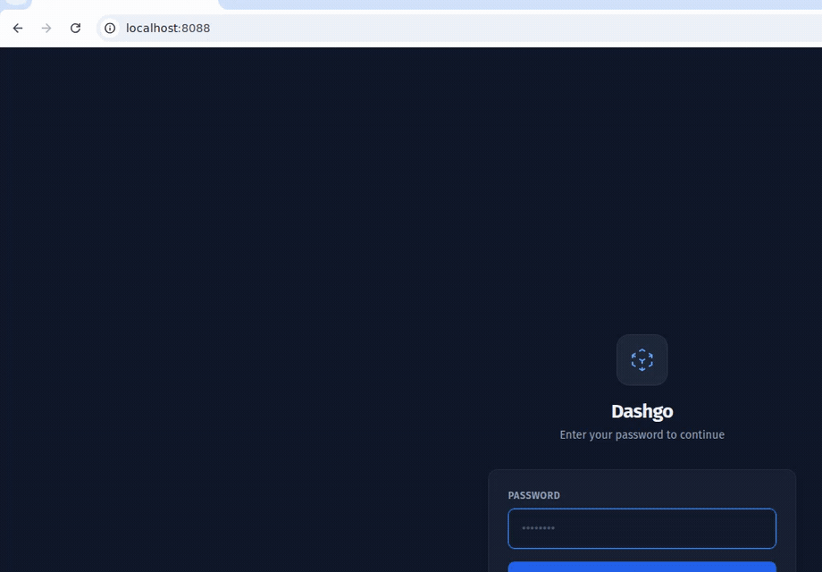

<div align="center">

# Dashgo

**A lightweight Docker dashboard for single-board computers and home servers.**

Go backend · React + TypeScript frontend · single binary · ~25 MB image · native Tailscale.

[](LICENSE)
[](backend-go/go.mod)
[](frontend)


[](https://tailscale.com)



</div>

## Why Dashgo?

Portainer is heavy for a Raspberry Pi. Dashgo is a single ~25 MB Alpine image that gives you a fast,
password-protected dashboard for your containers — with **Tailscale built in**, so every service gets a
clean `https://<host>.tailnet.ts.net` link you can reach from anywhere, no port-forwarding required.

- Runs comfortably on a Raspberry Pi / Orange Pi (multi-arch `amd64` + `arm64`)
- Hardware gauges (CPU, RAM, disk, **temperature**) right on the dashboard
- One binary, one container, no database to run

## Quick Start

**One-liner (published image):**

```bash
docker run -d --name dashgo -p 8088:8088 \
  -v /var/run/docker.sock:/var/run/docker.sock:ro \
  -v dashgo-data:/app/data \
  ghcr.io/happyfunnysad/dashgo:latest
```

**Or with Docker Compose (includes the Tailscale sidecar):**

```bash
git clone https://github.com/Happyfunnysad/Dashgo.git
cd Dashgo
docker compose up -d
```

Open **`http://<your-ip>:8088`**. On first launch you'll set an admin password — until that's done,
the API stays locked.

## Features

- **Onboarding Wizard** — guided first-time setup for password, Tailscale auth, and network settings
- **Dashboard** — real-time container monitoring with host metrics (CPU, RAM, disk, temperature)
- **Compose stacks** — containers grouped by project; start/stop/restart an entire stack at once
- **Details drawer** — click any container for ports, resource usage, live logs, inspect, and access links
- **Native Tailnet** — built-in Tailscale: device picker, online status, MagicDNS, and services published over your tailnet
- **Access links** — auto-generated Local / Tailscale / Domain links with smart IP auto-detection
- **Image updates** — checks the registry for newer images and flags outdated containers
- **Hardware monitoring** — CPU, memory, disk and temperature gauges (great for Orange Pi / Raspberry Pi)
- **Authentication** — password-protected UI with bcrypt, session tokens, and per-IP brute-force lockout
- **Webhook notifications** — POST alerts on container stop, unhealthy, or update-available events
- **Settings** — sectioned UI: General, Network, Tailscale, Notifications, Security, Advanced

## Stack

| Layer    | Technology                          |
|----------|-------------------------------------|
| Backend  | Go 1.24, net/http, Docker Engine API |
| Frontend | React 18, TypeScript, Vite, Tailwind CSS |
| Auth     | bcrypt (cost 12) + in-memory session tokens (24 h TTL) |
| Storage  | JSON file (`/app/data/config.json`) |
| Image    | Alpine Linux, ~25 MB final image, `amd64` + `arm64` |

## Architecture

```
┌─────────────────────────────────────────────────┐
│  Browser                                         │
│  React SPA (Dashboard · Tailnet · Settings)      │
└────────────────────┬─────────────────────────────┘
                     │ HTTP / JSON
┌────────────────────▼─────────────────────────────┐
│  Go Backend (single binary)                      │
│  ├── /api/containers    Container CRUD + stats   │
│  ├── /api/stats         Aggregate statistics     │
│  ├── /api/hardware      CPU, RAM, disk, temp     │
│  ├── /api/updates       Image update checks      │
│  ├── /api/tailscale/*   Tailscale status + mgmt  │
│  ├── /api/auth/*        Login, setup, logout     │
│  ├── /api/settings      Configuration            │
│  ├── /api/aliases       Container aliases        │
│  └── /api/projects/*    Compose stack actions    │
│                                                   │
│  Docker socket (/var/run/docker.sock, read-only)  │
│  Tailscale socket (shared /run/tailscale volume)  │
│  Host /proc, /sys (hardware metrics)              │
└───────────────────────────────────────────────────┘
```

## docker-compose.yml

```yaml
services:
  dashgo:
    build: .
    image: ghcr.io/happyfunnysad/dashgo:latest
    container_name: dashgo
    ports:
      - "8088:8088"
    volumes:
      - /var/run/docker.sock:/var/run/docker.sock:ro
      - ./data:/app/data
      - tailscale_sock:/run/tailscale
      - /proc:/host/proc:ro
      - /sys:/host/sys:ro
    environment:
      - NODE_ENV=production
      - DOCKER_SOCKET=/var/run/docker.sock
      - DB_PATH=/app/data/config.json
    restart: unless-stopped
    healthcheck:
      test: ["CMD", "wget", "--quiet", "--tries=1", "--spider", "http://localhost:8088/health"]
      interval: 30s
      timeout: 10s
      retries: 3
      start_period: 40s
    networks:
      - docker-dashboard-net

  tailscale:
    image: tailscale/tailscale:latest
    container_name: dashgo-tailscale
    hostname: dashgo-tailscale
    environment:
      - TS_AUTHKEY=${TS_AUTHKEY:-}
      - TS_STATE_DIR=/var/lib/tailscale
      - TS_SOCKET=/run/tailscale/tailscaled.sock
      - TS_USERSPACE=false
    volumes:
      - tailscale_data:/var/lib/tailscale
      - tailscale_sock:/run/tailscale
      - /dev/net/tun:/dev/net/tun
    cap_add:
      - net_admin
      - sys_module
    restart: unless-stopped
    networks:
      - docker-dashboard-net

networks:
  docker-dashboard-net:
    driver: bridge

volumes:
  tailscale_data:
  tailscale_sock:
```

## Project Structure

```
dashgo/
├── backend-go/
│   ├── main.go                    # Entry point
│   └── internal/
│       ├── api/handlers.go        # HTTP handlers + auth middleware
│       ├── auth/auth.go           # bcrypt auth + sessions + lockout
│       ├── db/db.go               # JSON config persistence (atomic, 0600)
│       ├── docker/docker.go       # Docker Engine API client
│       ├── docker/features.go     # Updates, hardware, Tailscale, webhooks
│       └── utils/network.go       # SSRF-safe webhook validation
├── frontend/
│   ├── src/
│   │   ├── pages/                 # Dashboard, TailscalePage, Settings, LoginPage
│   │   ├── components/            # Sidebar, Modals, Tailscale widgets
│   │   ├── hooks/                 # useTailscaleStatus
│   │   └── utils/                 # api.ts, formatters, authStorage
│   ├── index.html
│   └── vite.config.ts
├── Dockerfile                     # Multi-stage: node → go → alpine
├── docker-compose.yml
└── README.md
```

## Security

- Docker socket is mounted **read-only**
- API routes are protected by auth middleware (except `/health` and `/api/auth/status`)
- During first-run **setup** the API stays locked until an admin password is set
- Passwords are hashed with **bcrypt** (cost 12); minimum length 8
- **Per-IP brute-force lockout** — 5 failed logins → 15-minute block
- Sessions expire after **24 hours**
- Webhook URLs are **SSRF-validated** (loopback / private / metadata ranges blocked) with a request timeout
- Sensitive environment variables are **masked** in `inspect` output
- Config is written **atomically** with `0600` permissions

> **Note:** Access to the Docker socket grants root-level control over the host.
> Always set a password and restrict network access (a tailnet-only deployment is ideal).

## Environment Variables

| Variable        | Default                      | Description              |
|-----------------|------------------------------|--------------------------|
| `DOCKER_SOCKET` | `/var/run/docker.sock`       | Docker socket path       |
| `DB_PATH`       | `/app/data/config.json`      | Config file path         |
| `PORT`          | `8088`                       | HTTP listen port         |
| `TS_AUTHKEY`    | —                            | Tailscale auth key       |

## License

MIT
